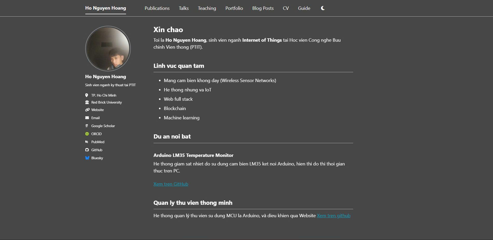

# Trang cá nhân của Hồ Nguyễn Hoàng



**Website:** [https://NguyenHoang05.github.io](https://NguyenHoang05.github.io)

Đây là trang web cá nhân được xây dựng bằng **GitHub Pages** và **Jekyll** với template **Academic Pages**. Nội dung bao gồm:

- Giới thiệu bản thân (About)
- Học vấn và kỹ năng (CV)
- Các dự án nổi bật (Portfolio)
- Liên kết đến GitHub và email

## Công nghệ sử dụng
- GitHub Pages, Jekyll, Markdown, YAML
- Template: [Academic Pages](https://github.com/academicpages/academicpages.github.io)

## Hướng dẫn sử dụng trang cá nhân
### 1. Xem thông tin
- Truy cập [https://NguyenHoang05.github.io](https://NguyenHoang05.github.io) để xem trang chủ.
- Sử dụng menu điều hướng để chuyển giữa các trang: **About**, **CV**, **Portfolio**.
- Nhấp vào các liên kết trong sidebar (GitHub, Email) để liên hệ hoặc xem hồ sơ GitHub.

### 2. Cập nhật nội dung (dành cho chủ sở hữu)
- **Sửa thông tin cá nhân**  
  Mở file `_config.yml`, tìm phần `author:` và sửa các trường như `name`, `bio`, `location`, `email`, `github`.
- **Thay đổi ảnh đại diện**  
  Thay file `images/avatar.jpg` bằng ảnh mới (tỉ lệ 1:1, kích thước 500x500px).
- **Chỉnh sửa trang About**  
  Sửa file `_pages/about.md` – nội dung giới thiệu, lĩnh vực quan tâm, dự án nổi bật.
- **Cập nhật CV**  
  Sửa file `_pages/cv.md` – học vấn, bảng kỹ năng, dự án.
- **Thêm dự án mới vào Portfolio**  
  Tạo file `.md` mới trong thư mục `_portfolio/` với cấu trúc front matter phù hợp. Xem mẫu `portfolio-1.md`.
- **Thay đổi cấu hình chung**  
  Sửa `_config.yml`: `title`, `description`, `url`, `navigation` (menu), `social` (liên kết mạng xã hội).

### 3. Đưa thay đổi lên GitHub
Sau khi sửa nội dung trên máy tính, chạy các lệnh sau trong terminal (Git Bash) tại thư mục dự án:

 [```bash
git add .
git commit -m "mô tả thay đổi"
git push origin main]

## Liên hệ
- Email: [nguyenhoang08052004@gmail.com]
- GitHub: [NguyenHoang05](https://github.com/NguyenHoang05)